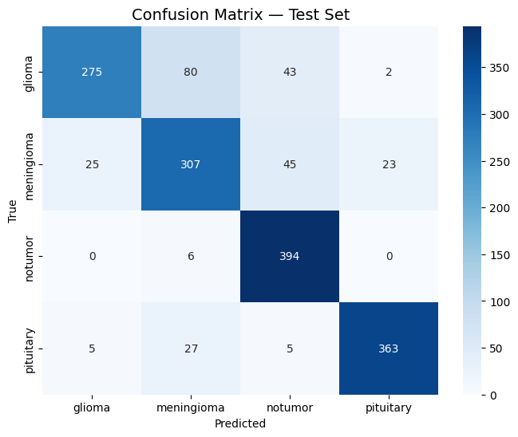
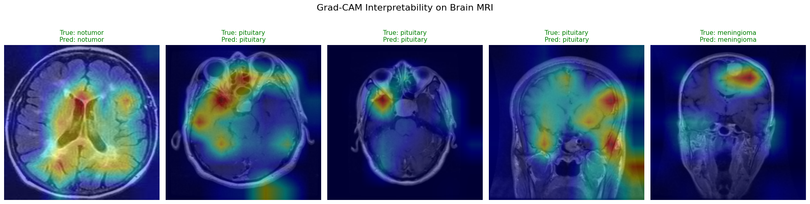

# Brain Tumor MRI Classification — ResNet50 + Grad-CAM

Automated classification of brain MRI scans into four tumor categories using transfer learning on ResNet50, with Grad-CAM saliency maps for interpretability. The system targets a practical gap in neuro-oncology workflows: providing both a diagnosis prediction and a spatial justification of that prediction, which is a prerequisite for clinical adoption of deep learning tools.

---

## Dataset

**Source:** [masoudnickparvar/brain-tumor-mri-dataset](https://www.kaggle.com/datasets/masoudnickparvar/brain-tumor-mri-dataset) (Kaggle)

| Split    | Images |
|----------|--------|
| Training | ~5,712 |
| Testing  |  ~1,311 |

**Classes:** Glioma · Meningioma · No Tumor · Pituitary

The dataset is **not included** in this repository. Run the script and it will download automatically via `kagglehub` (requires a Kaggle account and API token at `~/.kaggle/kaggle.json`).

---

## Technical Stack

| Component | Library |
|-----------|---------|
| Deep learning framework | PyTorch 2.x |
| Pretrained backbone | `torchvision` ResNet50 (IMAGENET1K_V2 weights) |
| Image I/O & preprocessing | OpenCV |
| Metrics & evaluation | Scikit-Learn |
| Grad-CAM | Custom implementation (no third-party CAM library) |
| Data analysis | Pandas, Matplotlib, Seaborn |

---

## Methodology

1. **Preprocessing** — Images are loaded as grayscale and converted to 3-channel RGB to match the ResNet input contract. Resized to 224×224.

2. **Data Augmentation** — Training set only: random rotation (±15°), random affine (translate ±10%, scale 0.9–1.1), random horizontal flip (p=0.5). Validation and test sets receive only resize + normalize.

3. **Transfer Learning** — ResNet50 backbone is fully frozen. Only the final fully-connected head (`fc: Linear(2048 → 4)`) is trained. This limits the trainable parameter count to ~8,196 out of 25.6M total.

4. **Training** — Adam optimizer (lr=1e-3), CrossEntropyLoss, `ReduceLROnPlateau` (factor=0.5, patience=2), EarlyStopping (patience=4). Up to 15 epochs; best weights saved by validation loss.

5. **Evaluation + Grad-CAM** — Test set classification report and confusion matrix. Grad-CAM saliency maps are generated on the last convolutional block (`layer4[-1]`) and overlaid on the original images.

---

## Results

| Class            | Precision | Recall | F1-Score |
|------------------|-----------|--------|----------|
| Glioma           | 0.92      | 0.64   | 0.75     |
| Meningioma       | 0.73      | 0.77   | 0.75     |
| No Tumor         | 0.81      | 0.99   | 0.89     |
| Pituitary        | 0.91      | 0.94   | 0.92     |
| **Weighted Avg** | **0.84**  | **0.83** | **0.83** |





---

## Grad-CAM Interpretability

Grad-CAM (Gradient-weighted Class Activation Mapping) computes the gradient of the predicted class score with respect to the feature maps of the last convolutional layer, then pools these gradients spatially to produce a heatmap. High-activation regions indicate which parts of the MRI drove the classification decision. For a brain tumor classifier, this directly maps to anatomical regions — a correctly firing Grad-CAM should highlight the lesion area, not background skull or ventricles. Producing this kind of spatial justification alongside the prediction is essential for clinical adoption, as radiologists need to verify that the model's reasoning is anatomically plausible before trusting it in a diagnostic workflow.

---

## Project Structure

```
Brain_MRI_Tumor_Classification/
├── brain_tumor_classification.py   # Main script (training + evaluation + Grad-CAM)
├── notebooks/
│   └── brain_tumor_classification.ipynb
├── assets/
│   ├── confusion_matrix.png
│   └── gradcam_examples.png
├── requirements.txt
└── .gitignore
```

---

## Usage

**Install dependencies:**
```bash
pip install -r requirements.txt
```

**Configure Kaggle credentials** (one-time setup):
```bash
# Place your kaggle.json at ~/.kaggle/kaggle.json
chmod 600 ~/.kaggle/kaggle.json
```

**Run the full pipeline:**
```bash
python brain_tumor_classification.py
```

The script will download the dataset, train the model, save `best_brain_mri_model.pth`, and write `assets/confusion_matrix.png` and `assets/gradcam_examples.png`.

**Or use the notebook:**
```bash
jupyter notebook notebooks/brain_tumor_classification.ipynb
```

---

## Limitations

1. **Meningioma performance** — The Meningioma class has the lowest F1-score (0.75) and the highest confusion with other tumor types. Meningiomas vary considerably in MRI appearance depending on grade and location, and the dataset size for this class may be insufficient to capture that variance.

2. **Single public dataset** — The model was trained and evaluated on one publicly available dataset. Generalization to images from different MRI machines, acquisition protocols, or demographic populations is untested.

3. **Not clinically validated** — This is a research prototype. It has not been evaluated against radiologist ground truth on clinical data, and should not be used for diagnostic purposes.

---

## Author

**Sarra Bounenni** — Biomedical Engineering Student, ESPITA Sousse
